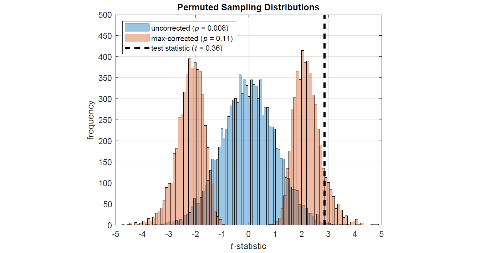
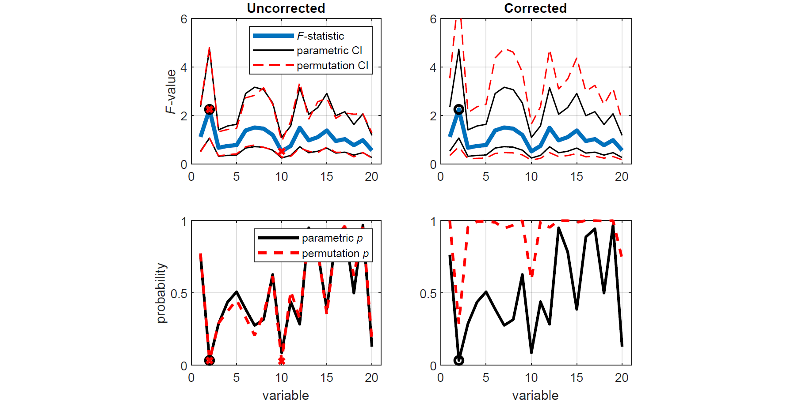
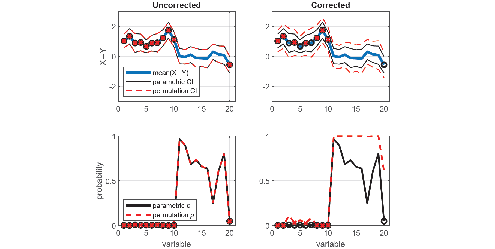
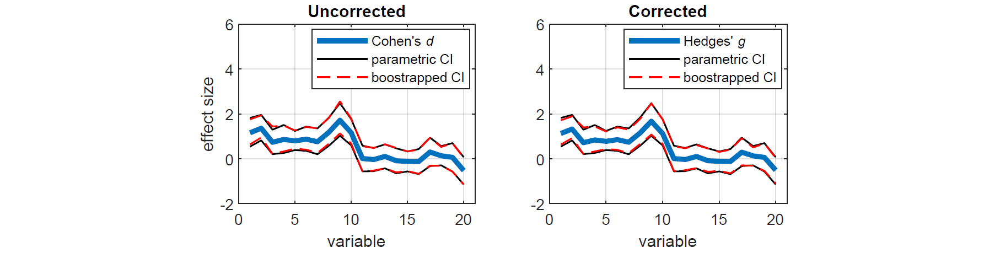
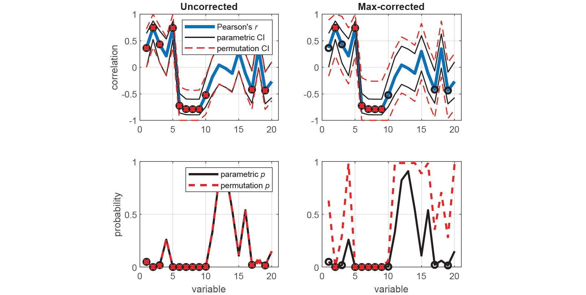

# 

[](https://opensource.org/licenses/BSD-3-Clause)

PERMUTOOLS is a MATLAB-based statistical software package for multivariate permutation testing. By comparing the magnitude of the test statistic of interest with those obtained using permutations of the data, it provides powerful, distribution-free hypothesis testing. Family-wise error rate (FWER) is controlled using max statistic correction (Blair *et al.*, 1994), making it suitable for multivariate or multiple permutation tests.

PERMUTOOLS offers permutation testing for a range of test statistics including the *t*-statistic (one-, paired-, and two-sample tests), *F*-statistic (unpaired), and correlation coefficient (Pearson, Spearman, rankit), as well as measures of effect size with bootstrapped confidence intervals (Cohen's *d*, Hedges' *g*, Glass' *Δ*, Cliff's *d*, unstandardised mean and median difference).

- [Installation](#installation)
- [Documentation](#documentation)
- [Max Statistic Correction](#max-statistic-correction)
- [Contents](#contents)
- [Examples](#examples)
- [License](#license)

## Installation

Download and unzip PERMUTOOLS to a local directory, then in the MATLAB/GNU Octave command window enter:

```matlab
addpath 'directory/PERMUTOOLS'
savepath
```

## Documentation

For documentation and citation, please refer to the [PERMUTOOLS paper](docs/Crosse_etal_2018.pdf).

For usage, please see [examples](#examples) and [example M-files](examples).

## Correction Methods used in PERMUTOOLS

### Max Statistic Correction for Multiple Tests

Max statistic correction, also referred to as *tmax* correction in the case of the *t*-statistic (Blair *et al.*, 1994), works by permuting the data in order to estimate the sampling distribution for each variable. In the case that there are multiple variables, the maximum value is taken across variables in order to produce a single, more-conservative sampling distribution (see figure below). This approach provides strong control of FWER, even for small sample sizes, and is much more powerful than traditional correction methods (Gondan, 2010; Groppe *et al.*, 2011a). For unpaired testing, it is also rather insensitive to differences in population variance when samples of equal size are used (Groppe *et al.*, 2011b). PERMUTOOLS automatically applies max statistic correction to multivariate tests, unless specified otherwise.

### Bias-correction for Sample Size

A common measure of effect size is the standardised mean differnce, known as Cohen's *d* (Cohen, 1969). Cohen's *d* has been shown to have an upwards bias of up to about 4%, particularly for sample sizes of less than 20. To correct for this bias, we chan apply a simple numerical scaling to the effect size and confidence intervals, which is approximately equal to $`1−3/(4n−9)`$ (Hedges, 1985). It is common to report such corrected effect size measures as Hedges' *g*. Note, the same correction can also be applied to effect size measures based on Glass' *Δ*, but not Cliff's *d*. PERMUTOOLS automatically applies bias correction to measures of Cohen's *d* and Glass' *Δ*, unless specified otherwise.

# 

## Contents

* `permuttest()` - one-sample or paired-sample permutation test with tmax correction
* `permuttest2()` - unpaired two-sample permutation test with tmax correction
* `permuvartest2()` - permutation-based *F*-test with max statistic correction
* `permucorr()` - permutation-based correlation coefficient with max statistic correction
* `booteffectsize()` - bias-corrected effect size measure with bootstrapped confidence intervals

## Examples

### Permutation tests for multivariate independent samples

The following example demonstrates how to test whether two independent samples come from distributions with equal means in PERMUTOOLS, and compares the test results to those of the equivalent parametric tests in MATLAB.

First, we generate random multivariate data for 2 "independent" samples X and Y. Each sample has 20 variables, each with a mean value of approximately 0, except for the first 10 variables of Y which have a mean value of approximately -1. Each variable has 30 observations.

```matlab
% Generate random data
rng(42);
x = randn(30,20);
y = randn(30,20);

% Make the first 10 variables of Y have a mean of -1
y(:,1:10) = y(:,1:10)-1;
```

Lets assume that we do not know whether the data in X and Y come from distributions with equal variances and thus whether we should use a two-sample Student's *t*-test or a Welch's *t*-test. To establish this, compare the variances of each corresponding variable in X and Y using two-tailed tests based on the *F*-statistic, first using the standard parametric approach (i.e. *F*-tests), and then using the equivalent non-parametric approach (i.e. permutation tests). For demonstration purposes, the permutation tests are conducted both with and without correction for multiple comparisons.

```matlab
% Run MATLAB's two-sample variance test (F-test)
[h,p,ci,stats] = vartest2(x,y);

% Run PERMUTOOLS' two-sample permutation variance test (uncorrected)
[hu,pu,ciu,statsu] = permuvartest2(x,y,'correct',0);

% Run PERMUTOOLS' two-sample permutation variance test (max-corrected)
[hc,pc,cic,statsc] = permuvartest2(x,y,'correct',1);
```

To demonstrate the benefit of permutation tests with max statistic correction over traditional parametric tests, we plot the *F*-statistic along with the parametric and permutation CIs for each test. Variables that are found to be significantly different (*p* < 0.05) are indicated by black circles (*F*-tests) and red x's (permutation tests). We see that applying max statistic correction widens the CIs of the test statistic such that none of the spuriously significant results survive.

```matlab
% Get F-statistic
f = statsc.fstat;
xaxis = 1:size(f,2);

% Plot parametric & uncorrected permutation CIs
figure('Name','Unpaired tests based on the F-statistic','NumberTitle','off')
set(gcf,'color','w')
subplot(2,2,1), hold on
plot(xaxis,f,'LineWidth',3)
plot(xaxis,ci,'k',xaxis,ciu,'--r','LineWidth',1)
plot(xaxis(logical(h)),f(logical(h)),'ok','LineWidth',2)
plot(xaxis(logical(hu)),f(logical(hu)),'xr','LineWidth',2)
ylim([0,6]), xlim([0,21]), box on, grid on
title('Uncorrected'), ylabel('{\itF}-value')
legend('{\itF}-statistic','parametric CI','','permutation CI','Location','northeast')

% Plot parametric & corrected permutation CIs
subplot(2,2,2), hold on
plot(xaxis,f,'LineWidth',3)
plot(xaxis,ci,'k',xaxis,cic,'--r','LineWidth',1)
plot(xaxis(logical(h)),f(logical(h)),'ok','LineWidth',2)
plot(xaxis(logical(hc)),f(logical(hc)),'xr','LineWidth',2)
ylim([0,6]), xlim([0,21]), box on, grid on
title('Corrected')
```

To demonstrate the effect of max statistic correction on the resulting *p*-values, we plot them for both the parametric and permutation tests, with significant results indicated as before.

```matlab
% Plot parametric & uncorrected permutation p-values
subplot(2,2,3), hold on
plot(xaxis,p,'k',xaxis,pu,'--r','LineWidth',2)
plot(xaxis(logical(h)),p(logical(h)),'ok','LineWidth',2)
plot(xaxis(logical(hu)),pu(logical(hu)),'xr','LineWidth',2)
ylim([0,1]), xlim([0,21]), box on, grid on
xlabel('variable'), ylabel('probability')
legend('parametric {\itp}','permutation {\itp}','Location','northeast')

% Plot parametric & corrected permutation p-values
subplot(2,2,4), hold on
plot(xaxis,p,'k',xaxis,pc,'--r','LineWidth',2)
plot(xaxis(logical(h)),p(logical(h)),'ok','LineWidth',2)
plot(xaxis(logical(hu)),pc(logical(hu)),'xr','LineWidth',2)
ylim([0,1]), xlim([0,21]), box on, grid on
xlabel('variable')
```

# 

Now that we have established that the data in X and Y come from distributions with equal variances, we can proceed to test whether they have equal means using an estimate of the *t*-statistic that uses their pooled standard deviation. We compare the means of each corresponding variable in X and Y using two-tailed (unpaired) tests, first using the standard parametric approach (i.e. *t*-tests), and then using the equivalent non-parametric approach (i.e. permutation tests), with and without max-correction.

```matlab
% Run MATLAB's two-sample t-test
[h,p,ci,stats] = ttest2(x,y);

% Run PERMUTOOLS' two-sample permutation test (uncorrected)
[hu,pu,ciu,statsu] = permuttest2(x,y,'correct',0);

% Run PERMUTOOLS' two-sample permutation test (max-corrected)
[hc,pc,cic,statsc] = permuttest2(x,y,'correct',1);
```

Here, we plot the mean difference along with the parametric and permutation CIs for each test (top panels), as well as the parametric and permutation *p*-values (bottom panels). Once again, we see that spuriously significant results in the uncorrected tests did not survive the max statistic criterion.

```matlab
% Compute the mean difference
md = mean(x)-mean(y);
xaxis = 1:size(md,2);

% Plot parametric & uncorrected permutation CIs
figure('Name','Unpaired tests based on the t-statistic','NumberTitle','off')
set(gcf,'color','w')
subplot(2,2,1), hold on
plot(xaxis,md,'LineWidth',3)
plot(xaxis,ci,'k',xaxis,ciu,'--r','LineWidth',1)
plot(xaxis(logical(h)),md(logical(h)),'ok','LineWidth',2)
plot(xaxis(logical(hu)),md(logical(hu)),'xr','LineWidth',2)
xlim([0,21]), ylim([-3,3]), box on, grid on
title('Uncorrected'), ylabel('X−Y')
legend('mean difference','parametric CI','','permutation CI','Location','southwest')

% Plot parametric & corrected permutation CIs
subplot(2,2,2), hold on
plot(xaxis,md,'LineWidth',3)
plot(xaxis,ci,'k',xaxis,cic,'--r','LineWidth',1)
plot(xaxis(logical(h)),md(logical(h)),'ok','LineWidth',2)
plot(xaxis(logical(hc)),md(logical(hc)),'xr','LineWidth',2)
xlim([0,21]), ylim([-3,3]), box on, grid on
title('Corrected')

% Plot parametric & uncorrected permutation p-values
subplot(2,2,3), hold on
plot(xaxis,p,'k',xaxis,pu,'--r','LineWidth',2)
plot(xaxis(logical(h)),p(logical(h)),'ok','LineWidth',2)
plot(xaxis(logical(hu)),pu(logical(hu)),'xr','LineWidth',2)
ylim([0,1]), xlim([0,21]), box on, grid on
xlabel('variable'), ylabel('probability')
legend('parametric {\itp}','permutation {\itp}','Location','southwest')

% Plot parametric & corrected permutation p-values
subplot(2,2,4), hold on
plot(xaxis,p,'k',xaxis,pc,'--r','LineWidth',2)
plot(xaxis(logical(h)),p(logical(h)),'ok','LineWidth',2)
plot(xaxis(logical(hc)),pc(logical(hc)),'xr','LineWidth',2)
ylim([0,1]), xlim([0,21]), box on, grid on
xlabel('variable')
```

# 

### Effect size measures for for multivariate independent samples

To measure the effect size of the above results, we can compute a standardised measure of mean difference known as Cohen's *d* that is bias-corrected for sample size (also known as Hedges' *g*). We can also calculate the corresponding bias-corrected CIs, estimated using an efficient bootstrapping  procedure. As before, we first compute the exact confidence intervals using the standard parametric approach (Student's *t*-distribution), as well as the equivalent non-parametric approach (bootstrapping). For demonstration purposes, the bootstrapped  effect sizes and CIs are computed with and without bias-correction.

```matlab
% Run MATLAB's effect size measure
d = zeros(1,20); ci = zeros(2,20);
for j = 1:20
    stats1 = meanEffectSize(x(:,j),y(:,j),'effect','cohen','paired',0);
    d(j) = stats1.Effect;
    ci(:,j) = stats1.ConfidenceIntervals';
end

% Run PERMUTOOLS' effect size measure (uncorrected)
[du,ciu] = booteffectsize(x,y,'effect','cohen','paired',0,'correct',0);

% Run PERMUTOOLS' effect size measure (bias-corrected)
[dc,cic] = booteffectsize(x,y,'effect','cohen','paired',0,'correct',1);
```

Here, we plot the resulting effect sizes measures along with their CIs. We see that bias-correcting the effect size and CIs according to sample size slightly reduces the overal measures, resulting in a more conservative estimate.

```matlab
% Plot parametric & uncorrected bootstrapped measures
figure('Name','Effect size measures based on Cohen''s d','NumberTitle','off')
set(gcf,'color','w')
subplot(2,2,1), hold on
plot(xaxis,du,'LineWidth',3)
plot(xaxis,ci,'k',xaxis,ciu,'--r','LineWidth',1)
ylim([-2,6]), xlim([0,21]), box on, grid on
title('Uncorrected'), xlabel('variable'), ylabel('effect size')
legend('Cohen''s {\itd}','parametric CI','','boostrapped CI')

% Plot parametric & corrected bootstrapped measures
subplot(2,2,2), hold on
plot(xaxis,dc,'LineWidth',3)
plot(xaxis,ci,'k',xaxis,cic,'--r','LineWidth',1)
ylim([-2,6]), xlim([0,21]), box on, grid on
title('Corrected'), xlabel('variable')
legend('Hedges'' {\itg}','parametric CI','','boostrapped CI')
```

# 

From the output of the above analyses, we can report the test statistics and effect size measures (adjusted for multiple comparisons and sample size) for any of the pairwise comparisons between X and Y. For example, the mean of the first variable of X was found to be significantly greater than that of Y, even after correction for multiple comparisons (*t*(58) = 4.49, *p* = 0.0008, Hedge's *g* = 1.14, 95CI [0.68, 1.72]).

### Correlation measures for multivariate data

The following example demonstrates how to measure the correlation between two multivariate samples in PERMUTOOLS, and compares the test results to those of the equivalent parametric tests in MATLAB.

First, we generate random multivariate data for 2 multivariate samples X and Y. Each sample has 20 variables, each pair with a correlation of 0, except for the first 5 variables which have a positive correlation, and the second 5 variables which have a negative correlation. Each variable has 30 observations.

```matlab
% Generate random data
rng(42);
x = randn(30,20);
y = randn(30,20);

% Make the some variables positively and negatively correlated
y(:,1:5) = y(:,1:5)+x(:,1:5)/2;
y(:,6:10) = y(:,6:10)-x(:,6:10);
xaxis = 1:20; alpha = 0.05;
```

We measure the correlation (Pearson's *r*) between each corresponding variable in X and Y using two-tailed tests, first using the standard parametric approach (i.e. Student's *t*-distribution), and then using the equivalent non-parametric approach (i.e. permutation tests), with and without max-correction.

```matlab
% Run MATLAB's correlation measure
[r,p] = corr(x,y);
r = diag(r);
p = diag(p);
ci = zeros(2,20);
for j = 1:20
    [~,~,clwr,cupr] = corrcoef(x(:,j),y(:,j));
    ci(:,j) = [clwr(2);cupr(2)];
end

% Run PERMUTOOLS' correlation measure (uncorrected)
[ru,pu,ciu,statsu] = permucorr(x,y,'correct',0);

% Run PERMUTOOLS' correlation measure (max-corrected)
[rc,pc,cic,statsc] = permucorr(x,y,'correct',1);
```

Here, we plot the correlation coefficients along with the parametric and permutation CIs for each test (top panels), as well as the parametric and permutation *p*-values (bottom panels). Once again, we see that spuriously significant results in the uncorrected tests did not survive the max statistic criterion.

```matlab
% Plot parametric & uncorrected permutation CIs
figure('Name','Correlation measures based on Pearson''s r','NumberTitle','off')
set(gcf,'color','w')
subplot(2,2,1), hold on
plot(xaxis,ru,'LineWidth',3)
plot(xaxis,ci,'k',xaxis,ciu,'--r')
plot(xaxis(p<=alpha),r(p<=alpha),'ok','LineWidth',2)
plot(xaxis(pu<=alpha),ru(pu<=alpha),'xr','LineWidth',2)
xlim([0,21]), ylim([-1,1]), box on, grid on
title('Uncorrected'), ylabel('correlation')
legend('Pearson''s {\itr}','parametric CI','','permutation CI')

% Plot parametric & corrected permutation CIs
subplot(2,2,2), hold on
plot(xaxis,rc,'LineWidth',3)
plot(xaxis,ci,'k',xaxis,cic,'--r')
plot(xaxis(p<=alpha),r(p<=alpha),'ok','LineWidth',2)
plot(xaxis(pc<=alpha),rc(pc<=alpha),'xr','LineWidth',2)
xlim([0,21]), ylim([-1,1]), box on, grid on
title('Max-corrected')

% Plot parametric & uncorrected permutation p-values
subplot(2,2,3), hold on
plot(xaxis,p,'k',xaxis,pu,'--r','LineWidth',2)
plot(xaxis(p<=alpha),p(p<=alpha),'ok','LineWidth',2)
plot(xaxis(pu<=alpha),pu(pu<=alpha),'xr','LineWidth',2)
xlim([0,21]), ylim([0,1]), box on, grid on
xlabel('variable'), ylabel('probability')
legend('parametric {\itp}','permutation {\itp}')

% Plot parametric & corrected permutation p-values
subplot(2,2,4), hold on
plot(xaxis,p,'k',xaxis,pc,'--r','LineWidth',2)
plot(xaxis(p<=alpha),p(p<=alpha),'ok','LineWidth',2)
plot(xaxis(pc<=alpha),pc(pc<=alpha),'xr','LineWidth',2)
xlim([0,21]), ylim([0,1]), box on, grid on
xlabel('variable')
```

# 

From the output of the above analysis, we can report the correlation coefficient and test statistics (adjusted for multiple comparisons) for any of the pairwise comparisons between X and Y. For example, the correlation between the second variable of X and Y was found to be significant, even after correction for multiple comparisons (*r*(28) = 0.74, 95CI [0.21, 1.0], *p* = 0.0002).

## Citation

If you publish any work using PERMUTOOLS, please cite as:

```
@article{crosse2018permutools,
  title={PERMUTOOLS: A MATLAB Package for Multivariate Permutation Testing},
  author={Crosse, Michael J and Foxe, John J and Molholm, Sophie},
  journal={In Prep},
  volume={},
  pages={},
  year={2018},
  publisher={}
}
```

## License

[BSD 3-Clause License](LICENSE)