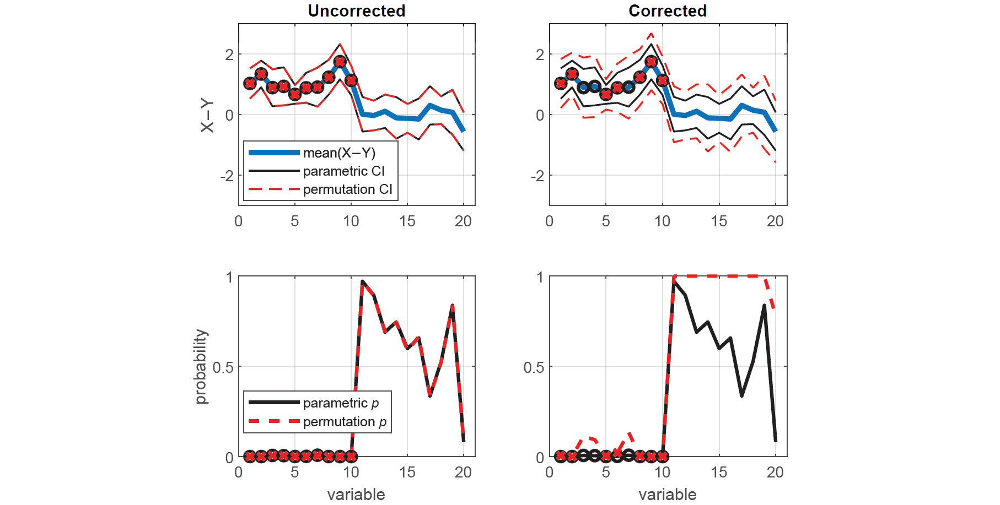

# 

[](https://opensource.org/licenses/BSD-3-Clause)

PERMUTOOLS is a MATLAB-based statistical software package for multivariate permutation testing. By comparing the magnitude of the test statistic of interest with those obtained using permutations of the data, it provides powerful, distribution-free hypothesis testing. Family-wise error rate (FWER) is controlled using the max statistic method (Blair *et al.*, 1994), making it suitable for multivariate or multiple permutation tests.

PERMUTOOLS offers permutation testing for a range of test statistics including the *t*-statistic (one-sample, paired, two-sample), *F*-statistic (unpaired), and correlation coefficient (Pearson, Spearman, rankit), as well as measures of effect size with bootstrapped confidence intervals (Cohen's *d*, Hedges' *g*, Glass' *Δ*).

- [Installation](#installation)
- [Documentation](#documentation)
- [Max Statistic Correction](#max-statistic-correction)
- [Contents](#contents)
- [Examples](#examples)
- [License](#license)

## Installation

Download and unzip PERMUTOOLS to a local directory, then in the MATLAB/GNU Octave command window enter:

```matlab
addpath 'directory/PERMUTOOLS'
savepath
```

## Documentation

For documentation and citation, please refer to the [PERMUTOOLS paper](docs/Crosse_etal_2018.pdf).

For usage, please see [examples](#examples) and [example M-files](examples).

## Max Statistic Correction

The max statistic correction method (Blair *et al.*, 1994) works by permuting the order or pairing of the data to estimate the sampling distribution for each variable. In the case that there are multiple variables, the maximum value is taken at every permutation across all variables in order to produce a single, more-conservative sampling distribution. This approach provides strong control of FWER, even for small sample sizes, and is much more powerful than traditional correction methods (Gondan, 2010; Groppe *et al.*, 2011a). For unpaired testing, it is also rather insensitive to differences in population variance when samples of equal size are used (Groppe *et al.*, 2011b).

## Contents

* `permuttest()` - one-sample or paired-sample permutation test with tmax correction
* `permuttest2()` - unpaired two-sample permutation test with tmax correction
* `permuvartest2()` - permutation-based *F*-test with max statistic correction
* `permucorr()` - permutation-based correlation test with max statistic correction
* `booteffectsize()` - bias-corrected effect size measure with bootstrapped confidence intervals

## Examples

### Permutation tests for dependent samples

Here, we generate random multivariate data for 2 "dependent" samples X and Y. Each sample has 20 variables, each with a mean value of 0, except for the first 10 variables of Y which have a mean value of -1. Each variable has 30 observations.

```matlab
% Generate random data
rng(42);
x = randn(30,20);
y = randn(30,20);

% Make the first 10 variables of Y have a mean of -1
y(:,1:10) = y(:,1:10)-1;
```

We compare the means of each corresponding variable in X and Y via two-tailed paired tests, first using the standard parametric approach (i.e. *t*-tests), and then using the equivalent non-parametric approach (i.e. permutation tests). The permutations test are conducted with and without correction for multiple comparisons.

```matlab
% Perform t-test
[h,p,ci] = ttest(x,y);

% Perform uncorrected permutation test
[hu,pu,ciu] = permuttest(x,y,'correct',false);

% Perform permutation test with tmax correction
[hc,pc,cic] = permuttest(x,y,'correct',true);
```

Here, we plot the mean difference with the parametric and permutation CIs for each test. Variables that are found to be significantly different at the 5% alpha level are indicated by black circles (*t*-tests) and red x's (permutation tests).

```matlab
% Compute the mean difference
diffxy = mean(x-y);
xaxis = 1:size(diffxy,2);

% Plot parametric & uncorrected permutation CIs
subplot(2,2,1), hold on
plot(xaxis,diffxy,'LineWidth',3)
plot(xaxis,ci,'k',xaxis,ciu,'--r')
plot(xaxis(logical(h)),diffxy(logical(h)),'ok','LineWidth',2)
plot(xaxis(logical(hu)),diffxy(logical(hu)),'xr','LineWidth',2)
ylim([-3,3]), xlim([0,21])
title('Uncorrected'), ylabel('X−Y')
legend('mean(X−Y)','parametric CIs','','permutation CIs','Location','southwest')

% Plot parametric & corrected permutation CIs
subplot(2,2,2), hold on
plot(xaxis,diffxy,'LineWidth',3)
plot(xaxis,ci,'k',xaxis,cic,'--r')
plot(xaxis(logical(h)),diffxy(logical(h)),'ok','LineWidth',2)
plot(xaxis(logical(hc)),diffxy(logical(hc)),'xr','LineWidth',2)
ylim([-3,3]), xlim([0,21])
title('Corrected')
```

Here, we plot the parametric and permutation *p*-values for each test with significant results indicated as before. We can see that not all of the variables found to be significantly different in the uncorrected tests survive the max statistic criterion.

```matlab
% Plot parametric & uncorrected permutation p-values
subplot(2,2,3), hold on
plot(xaxis,p,'k',xaxis,pu,'--r','LineWidth',2)
plot(xaxis(logical(h)),p(logical(h)),'ok','LineWidth',2)
plot(xaxis(logical(hu)),pu(logical(hu)),'xr','LineWidth',2)
ylim([0,1]), xlim([0,21])
xlabel('variable'), ylabel('probability')
legend('parametric {\itp}-value','permutation {\itp}-value','Location','southwest')

% Plot parametric & corrected permutation p-values
subplot(2,2,4), hold on
plot(xaxis,p,'k',xaxis,pc,'--r','LineWidth',2)
plot(xaxis(logical(h)),p(logical(h)),'ok','LineWidth',2)
plot(xaxis(logical(hu)),pc(logical(hu)),'xr','LineWidth',2)
ylim([0,1]), xlim([0,21])
xlabel('variable')
```

# 

### Effect size measure for dependent samples

To measure the effect size of the results, we can compute a measure of Cohen's *d* that is bias-corrected for sample size (also known as Hedges' *g*), as well as the corresponding bias-corrected CIs, estimated using an efficient bootrapping procedure. As before, we first compute the exact confidence intervals using the standard parametric approach (Student's *t*-distribution), as well as the equivalent non-parametric approach (bootrapping). The bootrapped effect sizes and CIs are computed with and without bias-correction.

```matlab
% Compute effect size & parametric CIs
d = zeros(1,20); ci = zeros(2,20);
for j = 1:20
    stats1 = meanEffectSize(x(:,j),y(:,j),'Effect','cohen','Paired',1);
    d(j) = stats1.Effect;
    ci(:,j) = stats1.ConfidenceIntervals';
end

% Compute uncorrected effect size & bootstrapped CIs
[du,ciu] = booteffectsize(x,y,'correct',false);

% Compute corrected effect size & bootstrapped CIs
[dc,cic] = booteffectsize(x,y,'correct',true);
```

Here, we plot the resulting effect sizes measures along with their CIs.

```matlab
% Plot parametric & uncorrected bootstrapped measures
figure, set(gcf,'color','w')
subplot(2,2,1), hold on
plot(xaxis,du,'LineWidth',3)
plot(xaxis,ci,'k',xaxis,ciu,'--r','LineWidth',1)
ylim([-2,6]), xlim([0,21]), box on, grid on
title('Uncorrected'), xlabel('variable'), ylabel('effect size')
legend('Cohen''s {\itd}','parametric CI','','boostrapped CI')

% Plot parametric & corrected bootstrapped measures
subplot(2,2,2), hold on
plot(xaxis,dc,'LineWidth',3)
plot(xaxis,ci,'k',xaxis,cic,'--r','LineWidth',1)
ylim([-2,6]), xlim([0,21]), box on, grid on
title('Corrected'), xlabel('variable')
legend('Hedges'' {\itg}','parametric CI','','boostrapped CI')
```

# 

## License

[BSD 3-Clause License](LICENSE)