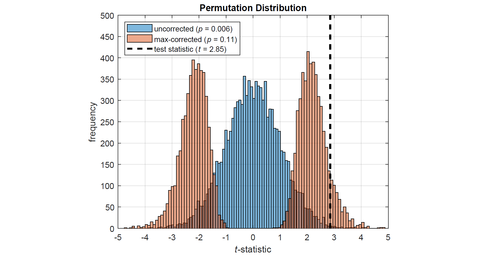
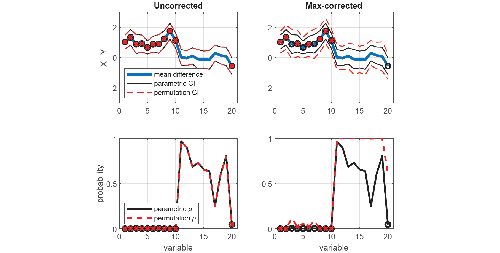
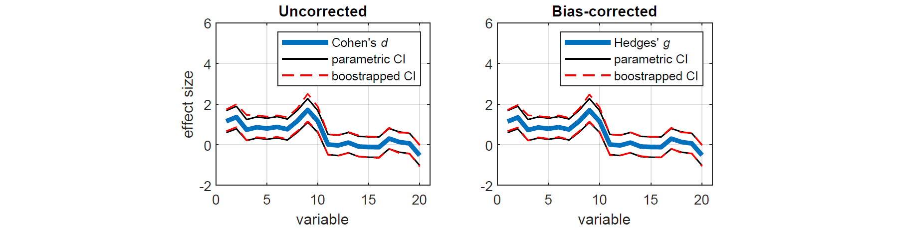
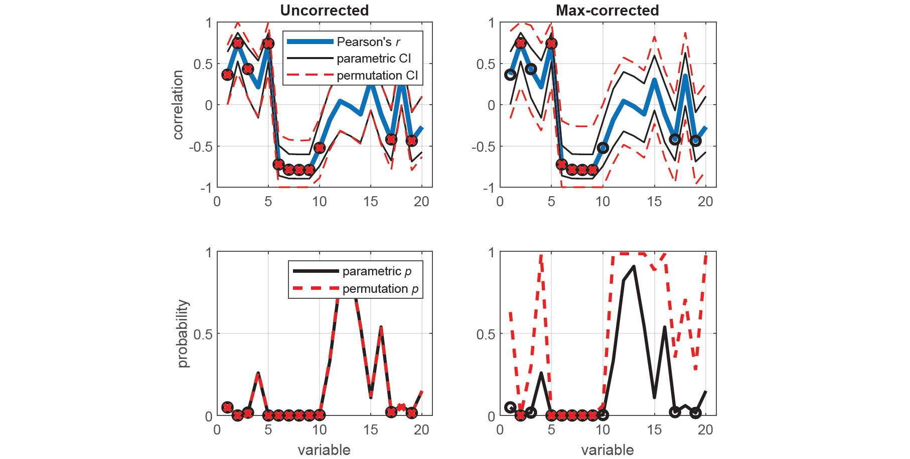

# 

[](https://github.com/mickcrosse/PERMUTOOLS/graphs/commit-activity)
[](https://uk.mathworks.com/matlabcentral/fileexchange/158176-permutools)
[](https://opensource.org/licenses/BSD-3-Clause)
[](https://doi.org/10.5281/zenodo.10556247)
[](https://doi.org/10.48550/arXiv.2401.09401)

PERMUTOOLS is a statistical software package for multivariate permutation testing and effect size measurement. It is optimised for multivariate data and uses efficient resampling algorithms to generate the sampling distribution empirically, providing distribution-free, nonparametric hypothesis testing and effect size analysis.

PERMUTOOLS offers permutation-based hypothesis testing and confidence interval estimation for a range of statistical tests, including the **ANOVA** (one-way, two-way), ***t*-test** (one-sample, paired-sample, two-sample) ***F*-test** (two-sample), ***Z*-test** (one-sample), and **correlation coefficient** (Pearson, Spearman, rankit). Multiple comparison correction is automatically applied using the max correction method, which is less prone to type II errors than conventional methods.

PERMUTOOLS also offers effect size measurement and bootstrapped confidence interval estimation for a range of standardised and unstandardised effect sizes, including **Cohen's *d***, **Hedges' *g***, **Glass' *Δ***, **Cliff's *d***, **unstandardised mean difference** and **unstandardised median difference**. Inflation of standardised effect size measures and their CIs due to sample size is controlled by applying a bias correction factor.

- [Installation](#installation)
- [Documentation](#documentation)
- [Contents](#contents)
- [Correction Features](#correction-features)
- [Examples](#examples)
- [Citation](#citation)
- [References](#references)
- [License](#license)

## Installation

### MATLAB

Download and unzip PERMUTOOLS to a local directory, then in the MATLAB command window enter:

```matlab
addpath(genpath('directory/PERMUTOOLS-1.1/permutools'))
savepath
```

Alternatively, use the MATLAB dialog box to install PERMUTOOLS. On the **Home tab**, in the **Environment** section, click **Set Path**. In the Set Path dialog box, click **Add Folder with Subfolders** and search for PERMUTOOLS in your local directory and select the `permutools` subfolder.

### Octave

Download and unzip PERMUTOOLS to a local directory, then in the Octave command window enter:

```octave
addpath(genpath('directory/PERMUTOOLS-1.1/octave'))
savepath
pkg load statistics
```

Alternatively, use the Octave dialog box to install PERMUTOOLS. In the **Edit** menu, click **Set Path**. In the Set Path dialog box, click the **Add Folder...** dropdown menu and select **Folder With Subfolders** and search for PERMUTOOLS in your local directory and select the `octave` subfolder.

## Documentation

For documentation and citation, please refer to the [*arXiv* paper](doc/Crosse_etal_arXiv_2024.pdf):

- Crosse MJ, Foxe JJ, Molholm S (2024) **PERMUTOOLS: A MATLAB Package for Multivariate Permutation Testing.** *arXiv* 2401.09401. https://doi.org/10.48550/arXiv.2401.09401

For usage, please see the example code provided in the [Examples](#examples) section below, as well the M-files in the [examples](examples) folder. For detailed usage, please see the help documentation in each of the function headers.

## Contents

PERMUTOOLS consists of the following set of functions:

| Function | Description |
| --- | --- |
| [**permuanova1()**](matlab/permuanova1.m) | One-way permutation-based analysis of variance (ANOVA) |
| [**permuanova2()**](matlab/permuanova2.m) | Two-way permutation-based analysis of variance (ANOVA) |
| [**permuttest()**](matlab/permuttest.m) | One/paired-sample permutation-based *t*-test with max correction |
| [**permuttest2()**](matlab/permuttest2.m) | Two-sample permutation-based *t*-test with max correction |
| [**permuvartest2()**](matlab/permuvartest2.m) | Two-sample permutation-based *F*-test with max correction |
| [**permuztest()**](matlab/permuztest.m) | One-sample permutation-based *Z*-test with max correction |
| [**permucorr()**](matlab/permucorr.m) | Permutation-based correlation analysis with max correction |
| [**booteffectsize()**](matlab/booteffectsize.m) | Effect size & bootstrapped confidence intervals with bias correction |

## Correction Features

### Max Correction for Multiple Comparisons

Max correction, also referred to as *t*<sub>max</sub> or joint correction, is an effective way of controlling family-wise error rate (FWER) when conducting multivariate permutation tests (Blair *et al.*, 1993, 1994; Westfall and Young, 1993). It works as follows: on each permutation of the data, the test statistic is computed for each variable and the maximum absolute value (or most extreme positive or negative value) is taken. Repeating this procedure thousands of times produces a single, more-conservative permutation distribution, against which the actual test statistic is compared (see figure below). Thus, the more tests there are to take the maximum across, the more conservative the permutation distribution naturally becomes. This highly intuitive approach provides strong control of FWER, even for small sample sizes, and is much more powerful than traditional correction methods (Gondan, 2010; Groppe *et al.*, 2011a,b; Rousselet, 2023). PERMUTOOLS automatically applies max correction to multivariate tests, unless specified otherwise.

### Bias Correction for Small Samples

A common effect size measure is the standardised mean difference, known as Cohen's *d* (Cohen, 1969). Standardised effect sizes have the advantage of being metric-free, meaning that they can be directly compared across different studies (Hentschke & Stuttgen, 2011). However, Cohen's *d* has been shown to have an upwards bias of up to about 4% for sample sizes of less than 50. This bias is somewhat reduced by using the pooled weighted standard deviation of the samples, instead of that of either sample. In addition, a bias correction factor can be applied to the effect size estimate, which is approximately equal to $`1−3/(4n−9)`$ (Hedges, 1985). When this correction factor is applied, it is usual to refer to the resulting estimate as Hedges' *g*. PERMUTOOLS automatically applies bias correction to measures of Cohen's *d* and Glass' *Δ*, unless specified otherwise.

# 

The above figure shows two permutation distributions based on the *t*-statistic – one with max correction (red), the other without (blue) – for synthetically generated data with 20 variables (i.e. corrected for 20 comparisons).

## Examples

The example code used to generate the results and plots below can be found in [run_github_examples.m](examples/run_github_examples.m), as well as more extensive examples for each function in the [examples](examples) folder.

### Permutation tests for multivariate data

The following example demonstrates how to test whether two independent samples come from distributions with equal means in PERMUTOOLS, and compares the test results to those of the equivalent parametric tests in MATLAB/Octave.

First, we generate random multivariate data for 2 "independent" samples X and Y. Each sample has 20 variables, each with a mean value of approximately 0, except for the first 10 variables of Y which have a mean value of approximately -1. Each variable has 30 observations.

```matlab
% Generate random data
rng(42);
x = randn(30,20);
y = randn(30,20);

% Make the first 10 variables of Y have a mean of -1
y(:,1:10) = y(:,1:10)-1;
```

Let's assume that we do not know whether the data in X and Y come from distributions with equal variances and thus whether we should use a two-sample Student's *t*-test or a Welch's *t*-test. To establish this, we compare the variances of each corresponding variable in X and Y using two-tailed tests based on the *F*-statistic, first using the standard parametric approach (i.e. *F*-tests), and then using the equivalent nonparametric approach (i.e. permutation tests). For demonstration purposes, the permutation tests are conducted both with and without correction for multiple comparisons.

```matlab
% Run MATLAB's two-sample parametric variance test (F-test)
[~,p,ci] = vartest2(x,y);

% Run PERMUTOOLS' two-sample permutation variance test (uncorrected)
[f,pu,ciu] = permuvartest2(x,y,'correct',0);

% Run PERMUTOOLS' two-sample permutation variance test (max-corrected)
[~,pc,cic] = permuvartest2(x,y,'correct',1);
```

To demonstrate the benefit of permutation tests with max correction over traditional parametric tests, we plot the *F*-statistic along with the parametric and permutation CIs for each test. Variables that are found to be significantly different (*p* < 0.05) are indicated by black o's (parametric tests) and red x's (permutation tests). We see that applying max correction widens the CIs of the test statistic such that none of the spuriously significant results survive.

```matlab
% Set up figure
figure('Name','Two-sample permutation F-test','NumberTitle','off')
set(gcf,'color','w')
xaxis = 1:size(f,2);
alpha = 0.05;

% Plot parametric & uncorrected permutation CIs
subplot(2,2,1), hold on
plot(xaxis,f,'LineWidth',3)
plot(xaxis,ci,'k',xaxis,ciu,'--r','LineWidth',1)
plot(xaxis(p<=alpha),f(p<=alpha),'ok','LineWidth',2)
plot(xaxis(pu<=alpha),f(pu<=alpha),'xr','LineWidth',2)
xlim([0,21]), ylim([0,6]), box on, grid on
title('Uncorrected'), ylabel('{\itF}-value')
legend('{\itF}-statistic','parametric CI','','permutation CI','Location','northeast')

% Plot parametric & corrected permutation CIs
subplot(2,2,2), hold on
plot(xaxis,f,'LineWidth',3)
plot(xaxis,ci,'k',xaxis,cic,'--r','LineWidth',1)
plot(xaxis(p<=alpha),f(p<=alpha),'ok','LineWidth',2)
plot(xaxis(pc<=alpha),f(pc<=alpha),'xr','LineWidth',2)
xlim([0,21]), ylim([0,6]), box on, grid on
title('Max-corrected')

% Plot parametric & uncorrected permutation p-values
subplot(2,2,3), hold on
plot(xaxis,p,'k',xaxis,pu,'--r','LineWidth',2)
plot(xaxis(p<=alpha),p(p<=alpha),'ok','LineWidth',2)
plot(xaxis(pu<=alpha),pu(pu<=alpha),'xr','LineWidth',2)
xlim([0,21]), ylim([0,1]), box on, grid on
xlabel('variable'), ylabel('probability')
legend('parametric {\itp}','permutation {\itp}','Location','northeast')

% Plot parametric & corrected permutation p-values
subplot(2,2,4), hold on
plot(xaxis,p,'k',xaxis,pc,'--r','LineWidth',2)
plot(xaxis(p<=alpha),p(p<=alpha),'ok','LineWidth',2)
plot(xaxis(pc<=alpha),pc(pc<=alpha),'xr','LineWidth',2)
xlim([0,21]), ylim([0,1]), box on, grid on
xlabel('variable')
```

# 

Now that we have established that the data in X and Y come from distributions with equal variances, we can proceed to test whether they have equal means using an estimate of the *t*-statistic that uses their pooled standard deviation. We compare the means of each corresponding variable in X and Y using two-tailed (unpaired) tests, first using the standard parametric approach (i.e. *t*-tests), and then using the equivalent nonparametric approach (i.e. permutation tests), with and without max-correction.

```matlab
% Run MATLAB's two-sample parametric t-test
[~,p,ci] = ttest2(x,y);

% Run PERMUTOOLS' two-sample permutation test (uncorrected)
[~,pu,ciu,stats] = permuttest2(x,y,'correct',0);

% Run PERMUTOOLS' two-sample permutation test (max-corrected)
[~,pc,cic] = permuttest2(x,y,'correct',1);
```

Here, we plot the mean difference with the parametric and permutation CIs for each test (top panels), as well as the parametric and permutation *p*-values (bottom panels). Once again, we see that spuriously significant results in the uncorrected tests did not survive the maximal statistic criterion.

```matlab
% Set up figure
figure('Name','Two-sample permutation t-test','NumberTitle','off')
set(gcf,'color','w')
xaxis = 1:size(f,2);
alpha = 0.05;

% Plot parametric & uncorrected permutation CIs
subplot(2,2,1), hold on
plot(xaxis,stats.mu,'LineWidth',3)
plot(xaxis,ci,'k',xaxis,ciu,'--r','LineWidth',1)
plot(xaxis(p<=alpha),stats.mu(p<=alpha),'ok','LineWidth',2)
plot(xaxis(pu<=alpha),stats.mu(pu<=alpha),'xr','LineWidth',2)
xlim([0,21]), ylim([-3,3]), box on, grid on
title('Uncorrected'), ylabel('X−Y')
legend('mean difference','parametric CI','','permutation CI','Location','southwest')

% Plot parametric & corrected permutation CIs
subplot(2,2,2), hold on
plot(xaxis,stats.mu,'LineWidth',3)
plot(xaxis,ci,'k',xaxis,cic,'--r','LineWidth',1)
plot(xaxis(p<=alpha),stats.mu(p<=alpha),'ok','LineWidth',2)
plot(xaxis(pc<=alpha),stats.mu(pc<=alpha),'xr','LineWidth',2)
xlim([0,21]), ylim([-3,3]), box on, grid on
title('Max-corrected')

% Plot parametric & uncorrected permutation p-values
subplot(2,2,3), hold on
plot(xaxis,p,'k',xaxis,pu,'--r','LineWidth',2)
plot(xaxis(p<=alpha),p(p<=alpha),'ok','LineWidth',2)
plot(xaxis(pu<=alpha),pu(pu<=alpha),'xr','LineWidth',2)
xlim([0,21]), ylim([0,1]), box on, grid on
xlabel('variable'), ylabel('probability')
legend('parametric {\itp}','permutation {\itp}','Location','southwest')

% Plot parametric & corrected permutation p-values
subplot(2,2,4), hold on
plot(xaxis,p,'k',xaxis,pc,'--r','LineWidth',2)
plot(xaxis(p<=alpha),p(p<=alpha),'ok','LineWidth',2)
plot(xaxis(pc<=alpha),pc(pc<=alpha),'xr','LineWidth',2)
xlim([0,21]), ylim([0,1]), box on, grid on
xlabel('variable')
```

# 

### Effect size measures for multivariate data

To measure the effect sizes of the above comparisons, we can compute a measure of the standardised mean difference known as Cohen's *d* that is bias-corrected for sample size (also known as Hedges' *g*). We can also calculate the corresponding bias-corrected CIs, estimated using an efficient bootstrapping procedure. As before, we first compute the exact confidence intervals using the standard parametric approach (Student's *t*-distribution), as well as the equivalent nonparametric approach (bootstrapping). For demonstration purposes, the bootstrapped effect sizes and CIs are computed with and without bias-correction.

```matlab
% Run MATLAB's parametric effect size measure
d = zeros(1,20); ci = zeros(2,20);
for j = 1:20
    stats1 = meanEffectSize(x(:,j),y(:,j),'effect','cohen','paired',0);
    d(j) = stats1.Effect;
    ci(:,j) = stats1.ConfidenceIntervals';
end

% Run PERMUTOOLS' bootstrapped effect size measure (uncorrected)
[du,ciu] = booteffectsize(x,y,'effect','cohen','paired',0,'correct',0);

% Run PERMUTOOLS' bootstrapped effect size measure (bias-corrected)
[dc,cic] = booteffectsize(x,y,'effect','cohen','paired',0,'correct',1);
```

Here, we plot the resulting effect sizes measures with their CIs. We see that bias-correcting the effect size and CIs according to sample size slightly reduces the overall measures, resulting in a more conservative estimate.

```matlab
% Plot parametric & uncorrected bootstrapped measures
figure('Name','Effect size measures based on Cohen''s d','NumberTitle','off')
set(gcf,'color','w')
subplot(2,2,1), hold on
plot(xaxis,du,'LineWidth',3)
plot(xaxis,ci,'k',xaxis,ciu,'--r','LineWidth',1)
ylim([-2,6]), xlim([0,21]), box on, grid on
title('Uncorrected'), xlabel('variable'), ylabel('effect size')
legend('Cohen''s {\itd}','parametric CI','','boostrapped CI')

% Plot parametric & corrected bootstrapped measures
subplot(2,2,2), hold on
plot(xaxis,dc,'LineWidth',3)
plot(xaxis,ci,'k',xaxis,cic,'--r','LineWidth',1)
ylim([-2,6]), xlim([0,21]), box on, grid on
title('Corrected'), xlabel('variable')
legend('Hedges'' {\itg}','parametric CI','','boostrapped CI')
```

# 

We can report the test statistics and effect size measures (adjusted for multiple comparisons and sample size) for any of the above pairwise comparisons between X and Y. For example, the mean of the first variable of X was found to be significantly greater than that of Y, even after correcting for multiple comparisons (*t*(58) = 4.49, *p* = 0.0008, Hedges' *g* = 1.14, 95CI [0.68, 1.72]).

### Correlation measures for multivariate data

The following example demonstrates how to measure the correlation between two multivariate samples in PERMUTOOLS, and compares the test results to those of the equivalent parametric tests in MATLAB/Octave.

First, we generate random multivariate data for 2 multivariate samples X and Y. Each sample has 20 variables, each pair with a correlation of 0, except for the first 5 variables which have a positive correlation, and the second 5 variables which have a negative correlation. Each variable has 30 observations.

```matlab
% Generate random data
rng(42);
x = randn(30,20);
y = randn(30,20);

% Make the some variables positively and negatively correlated
y(:,1:5) = y(:,1:5)+x(:,1:5)/2;
y(:,6:10) = y(:,6:10)-x(:,6:10);
xaxis = 1:20; alpha = 0.05;
```

We measure the correlation (Pearson's *r*) between each corresponding variable in X and Y using two-tailed tests, first using the standard parametric approach (i.e. Student's *t*-distribution), and then using the equivalent nonparametric approach (i.e. permutation tests), with and without max correction.

```matlab
% Run MATLAB's parametric correlation measure
[r,p] = corr(x,y);
r = diag(r);
p = diag(p);
ci = zeros(2,20);
for j = 1:20
    [~,~,clwr,cupr] = corrcoef(x(:,j),y(:,j));
    ci(:,j) = [clwr(2);cupr(2)];
end

% Run PERMUTOOLS' permutation correlation measure (uncorrected)
[ru,pu,ciu] = permucorr(x,y,'correct',0);

% Run PERMUTOOLS' permutation correlation measure (max-corrected)
[rc,pc,cic] = permucorr(x,y,'correct',1);
```

Here, we plot the correlation coefficients with the parametric and permutation CIs for each test (top panels), as well as the parametric and permutation *p*-values (bottom panels). Once again, we see that spuriously significant results in the uncorrected tests did not survive the maximal statistic criterion.

```matlab
% Plot parametric & uncorrected permutation CIs
figure('Name','Correlation measures based on Pearson''s r','NumberTitle','off')
set(gcf,'color','w')
subplot(2,2,1), hold on
plot(xaxis,ru,'LineWidth',3)
plot(xaxis,ci,'k',xaxis,ciu,'--r')
plot(xaxis(p<=alpha),r(p<=alpha),'ok','LineWidth',2)
plot(xaxis(pu<=alpha),ru(pu<=alpha),'xr','LineWidth',2)
xlim([0,21]), ylim([-1,1]), box on, grid on
title('Uncorrected'), ylabel('correlation')
legend('Pearson''s {\itr}','parametric CI','','permutation CI')

% Plot parametric & corrected permutation CIs
subplot(2,2,2), hold on
plot(xaxis,rc,'LineWidth',3)
plot(xaxis,ci,'k',xaxis,cic,'--r')
plot(xaxis(p<=alpha),r(p<=alpha),'ok','LineWidth',2)
plot(xaxis(pc<=alpha),rc(pc<=alpha),'xr','LineWidth',2)
xlim([0,21]), ylim([-1,1]), box on, grid on
title('Max-corrected')

% Plot parametric & uncorrected permutation p-values
subplot(2,2,3), hold on
plot(xaxis,p,'k',xaxis,pu,'--r','LineWidth',2)
plot(xaxis(p<=alpha),p(p<=alpha),'ok','LineWidth',2)
plot(xaxis(pu<=alpha),pu(pu<=alpha),'xr','LineWidth',2)
xlim([0,21]), ylim([0,1]), box on, grid on
xlabel('variable'), ylabel('probability')
legend('parametric {\itp}','permutation {\itp}')

% Plot parametric & corrected permutation p-values
subplot(2,2,4), hold on
plot(xaxis,p,'k',xaxis,pc,'--r','LineWidth',2)
plot(xaxis(p<=alpha),p(p<=alpha),'ok','LineWidth',2)
plot(xaxis(pc<=alpha),pc(pc<=alpha),'xr','LineWidth',2)
xlim([0,21]), ylim([0,1]), box on, grid on
xlabel('variable')
```

# 

We can report the correlation coefficient and test statistics (adjusted for multiple comparisons) for any of the above pairwise comparisons between X and Y. For example, the correlation between the second variable of X and Y was found to be significant, even after correcting for multiple comparisons (*r*(28) = 0.74, 95CI [0.21, 1.0], *p* = 0.0002).

## Citation

If you publish any work using PERMUTOOLS, please it cite as:

Crosse MJ, Foxe JJ, Molholm S (2024) **PERMUTOOLS: A MATLAB Package for Multivariate Permutation Testing.** *arXiv* 2401.09401.

```
@misc{crosse2024permutools,
      title={PERMUTOOLS: A MATLAB Package for Multivariate Permutation Testing}, 
      author={Michael J. Crosse and John J. Foxe and Sophie Molholm},
      year={2024},
      eprint={2401.09401},
      archivePrefix={arXiv},
      primaryClass={stat.ME}
}
```

## References

1. Blair RC, Karniski W (1993) An alternative method for significance testing of waveform difference potentials. *Psychophysiology*, 30(5):518–524.
2. Blair RC, Higgins JJ, Karniski W, Kromrey JD (1994) A Study of Multivariate Permutation Tests Which May Replace Hotelling's T2 Test in Prescribed Circumstances. *Multivariate Behav Res*, 29(2):141–163.
3. Westfall PH, Young SS (1993) Resampling-based multiple testing: Examples and methods for p-value adjustment. New York, NY: *John Wiley & Sons*.
4. Gondan M (2010) A permutation test for the race model inequality. *Behav Res Methods*, 42(1):23–28.
5. Groppe DM, Urbach TP, Kutas M (2011a) Mass univariate analysis of event-related brain potentials/fields I: A critical tutorial review. *Psychophysiology*, 48(12):1711–1725.
6. Groppe DM, Urbach TP, Kutas M (2011b) Mass univariate analysis of event-related brain potentials/fields II: Simulation studies. *Psychophysiology*, 48(12):1726–1737.
7. Groppe DM (2016) Combating the scientific decline effect with confidence (intervals). *Psychophysiology*, 54(1):139–145.
8. Bishara AJ, Hittner JB, (2012) Testing the Significance of a Correlation With Nonnormal Data: Comparison of Pearson, Spearman, Transformation, and Resampling Approaches. *Psychol Methods*, 17(3):399–417.
8. Bishara AJ, Hittner JB, (2017) Confidence intervals for correlations when data are not normal. *Behav Res*, 49:294–309.
10. Hentschke H, Stuttgen MC (2011) Computation of measures of effect size for neuroscience data sets. *Eur J Neurosci*, 34:1887–1894.
11. Cohen J (1969) Statistical power for the behavioural sciences. London: *Academic Press*.
12. Hedges LV, Olkin I (1985) Statistical methods for meta-analysis. San Diego, CA: *Academic Press*.

## License

[BSD 3-Clause License](LICENSE)